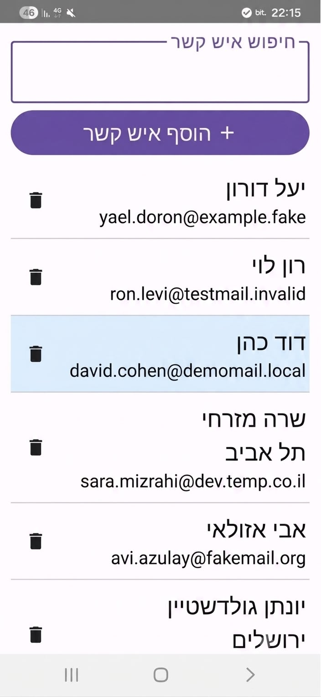
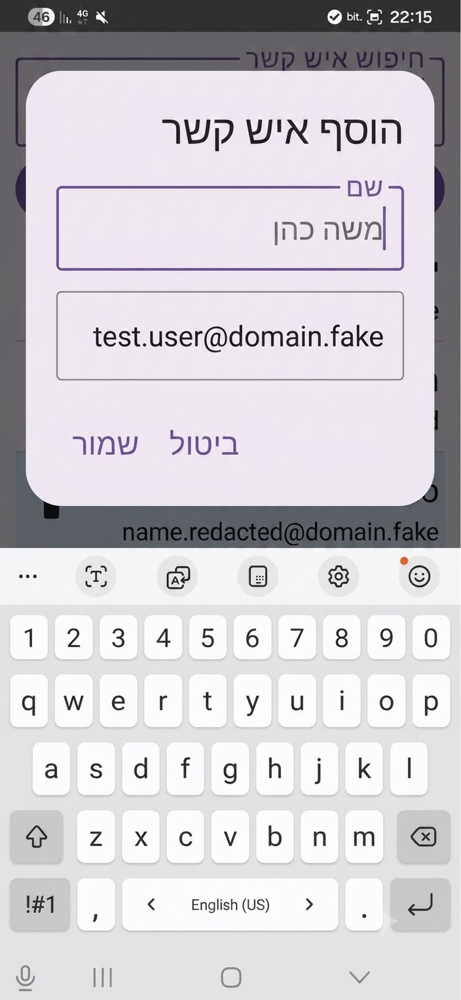
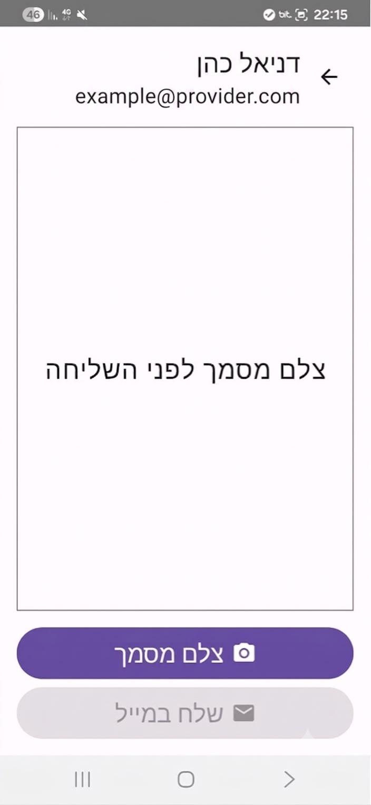
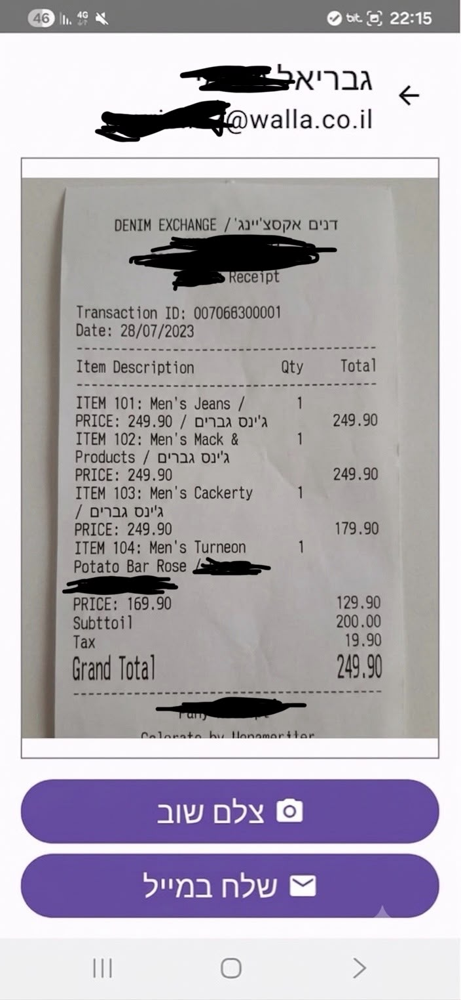

# Hesbonit Mail (`מייל חשבונית מס`)

A lightweight, native Android app built with Kotlin and Jetpack Compose for scanning physical tax invoices, auto-formatting them into single-page A4 PDFs on-device, and emailing them directly to saved contacts via Gmail.

---

## App Screenshots

<p align="center">
  
  &nbsp;&nbsp;
  
  &nbsp;&nbsp;
  
  &nbsp;&nbsp;
  
</p>

---

## Key Features

* **Contact Directory:** Fast name filtering powered by Room DB and Kotlin Flow.
* **Camera Capture:** `FileProvider` URI generation, automatic EXIF orientation rotation, and memory-safe bitmap downsampling.
* **A4 PDF Engine:** Scales captured images into standardized single-page A4 PDFs using native Android `PdfDocument`.
* **Gmail Dispatch:** Fires `ACTION_SEND` intents directly to Gmail with pre-filled recipient, subject, body, and attached PDF.
* **Native RTL Support:** Hebrew UI layout out of the box using Material 3.

---

## Tech Stack

* **Language:** Kotlin (1.9.24)
* **UI Framework:** Jetpack Compose + Material 3
* **Local Database:** Room (2.6.1)
* **Asynchronous Flow:** Coroutines + Flow
* **Minification:** R8 / ProGuard keep rules configured
* **CI/CD:** GitHub Actions (Unit testing, release builds, APK/AAB bundling)

---

## Project Architecture

```text
com.invoicemail.hesbonit/
├── AppDatabase.kt          # Room DB singleton
├── Contact.kt / ContactDao # Entity & DAO interfaces
├── ContactRepository.kt    # Data layer repository
├── ContactViewModel.kt     # Reactive search logic & state
├── PdfUtils.kt             # Image downsampling, EXIF fix & PDF rendering
├── EmailUtils.kt           # Gmail ACTION_SEND intent builder
├── MainActivity.kt         # Compose entry point with RTL layout provider
└── AppRoot.kt / Screens    # Screen routing & Compose UI components
